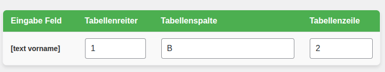
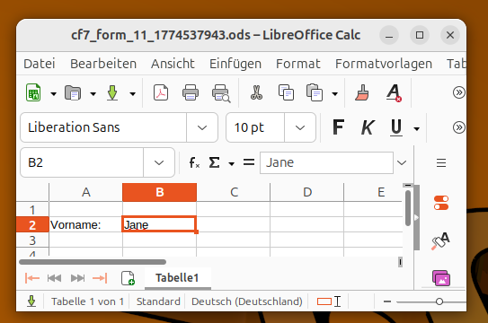

# Internetseite befüllt Excel-Vorlage für eMail (Wordpress)
Sie wollen Formulareingaben im Internet als .ods-eMail empfangen? Hier sind Sie richtig.

## Anleitung
Diese Anleitung soll helfen die online/internet/web Formulare in Excel-Dateien abzuschicken.
### 1. Anmelden
Sie haben also eine Internetseite. Sie müssen sich bei der Internetseite anmelden. Üblicherweise ist das Wordpress-Logo über der Anmeldemaske zu sehen. Dazu benötigen Sie ihre eMail-Adresse oder ihren Benutzernamen und ihr Passwort. Kennen Sie die Zugangsdaten nicht, fragen Sie bitte ihren Administrator oder ihren Hoster. Nach der Anmeldung landen Sie üblicherweise auf dem sogenannten "Dashboard".
### 2. Ein Formular erstellen
Auf der linken Seite der Wordpress-Internetseite sehen sie ein Menü. Dort müssen sie auf "Formulare" drücken. Hier sehen Sie eine Liste der Formulare die bereits existieren. Um ein neues Formular zu erstellen drücken sie auf den Knopf "Kontaktformular hinzufügen". Geben sie dann einen Titel ein und Gestalten sie ihr Formular wie gewünscht. Sobald sie fertig sind, drücken sie auf "Speichern". Sie kommen dann zur Übersicht der Formulare zurück.
### 3. Öffnen sie das .ods-Mapping
Auf der linken Seite der Wordpress-Internetseite sehen sie ein Menü. Dort müssen sie auf "Einstellungen" drücken. Es wird sich ein Untermenü öffnen, dort drücken sie auf "CF7 .ODS Mapping". Der Begriff Mapping kommt aus dem Englischen und bedeutet soviel wie das "Abbilden". 
### 4. Wählen sie das Formular aus das die Excel-Datei befüllen soll
Im .ods-Mapping finden sie oben das Formular-Feld. Wählen sie das Formular das sie im Schritt 2 erstellt haben. 
Wenn das Formular ausgewählt wurde erscheint eine grüne Tabelle.
### 5. Verbinden der Formularfelder mit der Wunschzelle
In der Tabelle sind vier Spalten. Die erste Spalte enthält alle Felder aus dem Formular, die anderen 3 Spalten geben an, welche Zelle geändert werden soll. Ist zum Beispiel ein Feld "Vorname" im Formular, und möchten sie den Vornamen in der Excel-Datei im ersten Reiter in Zelle B-2 speichern, dann geben Sie in der Zeile für "Vorname" die Werte 

- 1 (für den ersten Reiter)
- B (für die Spalte in der Excel-Datei)
- 2 (für die Reihe in der Excel-Datei)

ein. Die Tabelle sieht dann so aus:

Sind zu einem Formularfeld keine Eingaben gemacht, wird das Feld nicht in die Excel-Datei geschrieben. Achtung: Falsche Eingaben werden stark sichbar kenntlich gemacht um zu verhindern dass ungeordnete Eingaben entstehen.
### 6. Excel-Datei Vorlage hochladen
Die Excel-Datei die durch das Formular ausgefüllt werden soll kann mit dem Knopf ".ods-Datei ändern ..." hochgeladen werden.
### 7. Versand testen
Öffnen sie das Formular das in Schritt 2 erstellt wurde und Tragen sie einen Vornamen ein, zum Beispiel "Jane". Senden Sie das Formular ab. Sie haben wie üblich jetzt eine eMail bekommen, öffnen Sie die eMail und sie werden sehen dass dort eine .ods-Datei angehängt wurde. Es ist eine Kopie der .ods-Datei die in Schritt 6 hochgeladen wurde, jedoch sind die gemappten Felder aus Schritt 5 mit den Werten aus dem Formular gefüllt. Zum Beispiel Jane. Beispiel:

